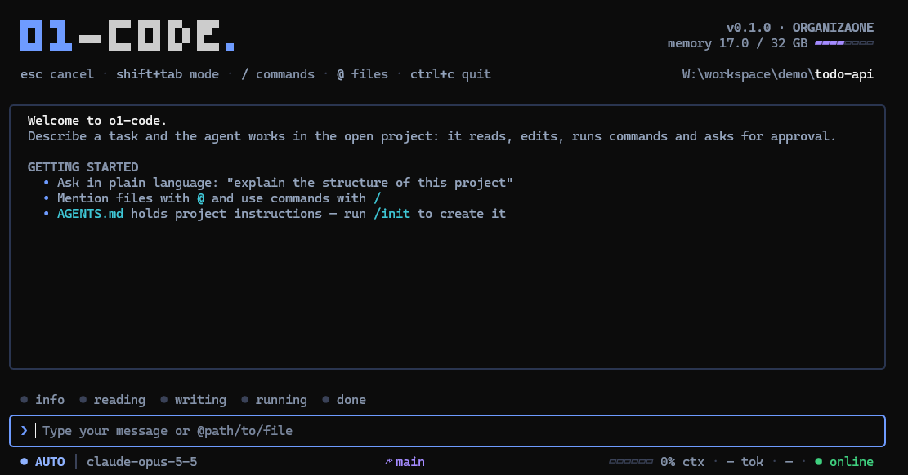

<h1 align="center">o1-code</h1>

<p align="center">
  An open-source AI coding agent for your terminal.<br>
  Any model provider, given by its URL.
</p>

<p align="center">
  <a href="https://www.npmjs.com/package/@organizaone/o1-code"></a>
  <a href="https://www.npmjs.com/package/@organizaone/o1-code"></a>
  <a href="https://nodejs.org/"></a>
  <a href="./LICENSE"></a>
  <a href="https://github.com/organizaone/o1-code/actions/workflows/o1-ci.yml"></a>
  <a href="https://github.com/organizaone/o1-code/releases"></a>
</p>

o1-code reads your project, edits files, runs commands and works through multi-step tasks according
to your selected approval mode. It talks to the model provider you choose: a built-in preset, a model
running on your machine, or any OpenAI-compatible or Anthropic endpoint by its base URL.

<p align="center">
  
</p>

## Install

```bash
npm install -g @organizaone/o1-code@latest
```

Requires [Node.js](https://nodejs.org/) 22 or later, on Windows, macOS or Linux. No administrator
rights and no compiler. To try it without installing, run `npx @organizaone/o1-code@latest`. To run an
unreleased change, see [Build from source](./docs/developers/build-from-source.md).

## Get started

```bash
cd your-project
o1-code
```

**1. Connect a provider.** On first launch you choose how to connect. Run `/auth` at any time to
change it.

- **API key** for a built-in provider: Anthropic, OpenAI, Google Gemini, DeepSeek, xAI, Kimi,
  MiniMax, Z.AI and others. The key is stored in `~/.o1-code/credentials/`, never in settings.
- **Local** models on this machine: Ollama and LM Studio are detected on their ports; any other
  local server is given by its port or URL. No key needed.
- **Custom**: any OpenAI-compatible or Anthropic endpoint, by base URL, key and model list. Use it
  for a proxy, a gateway or a provider without a preset.

**2. Ask.** Describe what you want in plain language:

```text
explain the structure of this project
add input validation to POST /todos: reject an empty title with a 400, and add a test for it
```

**3. Approve.** o1-code shows edits and commands that require approval before running them and waits for you. Press
`Shift+Tab` to change the approval mode, `/help` to list the commands, `?` for the shortcuts.

## Features

**Work with any model**

- [Model providers](./docs/users/configuration/model-providers.md) by URL: OpenAI-compatible and
  Anthropic protocols, built-in presets, local servers such as Ollama, vLLM and LM Studio. Switch
  models at runtime with `/model`.
- [Authentication](./docs/users/configuration/auth.md) with keys kept out of your settings file,
  and several providers side by side.

**Let the agent do the work**

- Reads, edits and searches files, runs shell commands, fetches web pages, and uses
  [MCP servers](./docs/users/features/mcp.md) and [language servers](./docs/users/features/lsp.md).
- [Goals](./docs/users/features/goals.md) run a multi-step task to completion,
  [sub-agents](./docs/users/features/sub-agents.md) split it up, and
  [scheduled tasks](./docs/users/features/scheduled-tasks.md) run it later.
- Works in a [git worktree](./docs/users/features/worktree.md) to keep experiments off your branch,
  and [reviews code](./docs/users/features/code-review.md) on request.

**Stay in control**

- [Approval modes](./docs/users/features/approval-mode.md) from plan-only to fully autonomous, with
  [auto mode](./docs/users/features/auto-mode.md) letting a classifier approve the safe calls.
- [Trusted folders](./docs/users/configuration/trusted-folders.md), an optional
  [sandbox](./docs/users/features/sandbox.md), and a [`.o1-code-ignore`](./docs/users/configuration/o1-code-ignore.md)
  file for what the agent must not read.
- [Tool-use summaries](./docs/users/features/tool-use-summaries.md) and a
  [context cost](./docs/users/features/context-cost.md) view show what the agent did and what it
  spent.

**Make it yours**

- [Skills](./docs/users/features/skills.md), [hooks](./docs/users/features/hooks.md),
  [rules](./docs/users/features/rules.md) and [custom commands](./docs/users/features/commands.md).
- [Output styles](./docs/users/features/output-styles.md), [themes](./docs/users/configuration/themes.md),
  a [status line](./docs/users/features/status-line.md) and
  [extensions](./docs/users/extension/introduction.md) that bundle them.
- Project instructions in `AGENTS.md`, [memory](./docs/users/features/memory.md) across sessions,
  session resume and compaction.

**Beyond the terminal**

- [Headless mode](./docs/users/features/headless.md): `o1-code -p "..."` in scripts and CI, with
  [structured output](./docs/users/features/structured-output.md).
- `o1-code serve`: a daemon with a browser Web Shell and a
  [documented protocol](./docs/developers/o1-code-serve-protocol.md).
- Editor integration for [VS Code](./docs/users/integration-vscode.md),
  [Zed](./docs/users/integration-zed.md) and [JetBrains IDEs](./docs/users/integration-jetbrains.md).
- Interface in English and Brazilian Portuguese, reviewed by hand, plus other
  [languages](./docs/users/features/language.md).

## Documentation

| Read this                                                          | When                             |
| ------------------------------------------------------------------ | -------------------------------- |
| [Quickstart](./docs/users/quickstart.md)                           | Your first session, step by step |
| [Overview](./docs/users/overview.md)                               | A tour of what o1-code does      |
| [Commands](./docs/users/features/commands.md)                      | Every slash command              |
| [Keyboard shortcuts](./docs/users/reference/keyboard-shortcuts.md) | Moving around the interface      |
| [Settings](./docs/users/configuration/settings.md)                 | Every option in `settings.json`  |
| [Troubleshooting](./docs/users/support/troubleshooting.md)         | Something does not work          |
| [Build from source](./docs/developers/build-from-source.md)        | Running the repository's code    |
| [ROADMAP.md](./ROADMAP.md)                                         | What comes next                  |

## Principles

- **The terminal is the product.** The Web Shell, the SDK and the editor integrations serve it.
- **Any provider by URL is first-class.** An endpoint given by its base URL and a key is never a
  second-class path.
- **Runs as a user.** No administrator rights, no Rust or Go toolchain; native modules are prebuilt
  or optional. Windows is a first-class platform.
- **Telemetry is opt-in.** Your prompts and code go to the provider you configure.
  OpenTelemetry exports are disabled by default and use the collector you configure. See
  [Terms of service and privacy](./docs/users/support/tos-privacy.md).
- **Extension mechanisms first.** Skills, hooks, MCP, rules, output styles, themes and
  `modelProviders` before changes to the core.
- **Apache-2.0, respected.** `LICENSE`, `NOTICE` and third-party copyright headers are kept.

## Contributing

Contributions are welcome: see [CONTRIBUTING.md](./CONTRIBUTING.md) for the workflow and how to
propose a feature. Security issues go through [SECURITY.md](./SECURITY.md).

## License

Apache-2.0, see [LICENSE](./LICENSE) and [NOTICE](./NOTICE).
